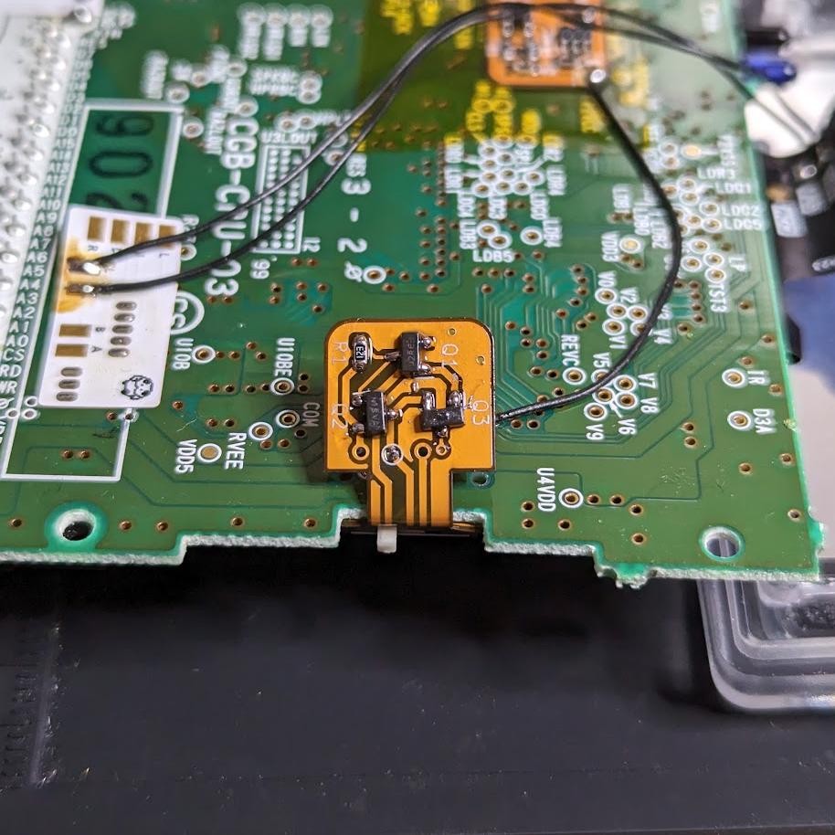

# Overview

This is a replacement power switch circuit for the Game Boy Color that utilizes MOSFETs to switch system power, rather than shunting it directly through the physical switch. In theory, this should ensure proper functionality even when the switch is dirty.

# Disclaimer
I have installed this in one GBC, and it continues to work after ~3 years, but I can't make specific claims about longevity.

# BOM
| Designator | Description | Footprint | Part # |
| ---------- | ----------- | --------- | ------ |
| R1 | 10K | 0603 | - |
| Q2, Q3 | P-FET | SOT-23 | DMP6350SQ-7 |
| Q1 | N-FET | SOT-23 | SI2312BDS-T1-BE3 |
| SW1 | SP3T switch | - | MSKT-13C01 |

# License
<a href="github.com/leggomyfroggo/GameBoyDump/PCBs/CGBMOSFETSwitch">CGB MOSFET Switch</a> © 2022 by <a href="github.com/LeggoMyFroggo">Chris Hackmann</a> is licensed under <a href="https://creativecommons.org/licenses/by-nc-sa/4.0/">CC BY-NC-SA 4.0</a>